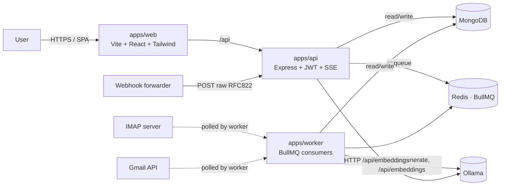

# 00 — Architecture

Rose ingests emails, asks a locally-running Ollama model to draft a wiki page from each
one, persists the result in MongoDB, and serves it through a React SPA with hybrid
keyword + semantic search.

## Topology

## Processes

- **`apps/web`** — SPA built with Vite, served by Nginx in prod; talks to the API at `/api`.
- **`apps/api`** — Express. Handles auth, REST CRUD, SSE for streaming jobs, the inbound
  webhook, and search. Read-only Ollama calls (live embeddings for query vectors) happen
  here; write paths enqueue work for the worker.
- **`apps/worker`** — BullMQ consumers for `generate-page`, `embed-page`, `imap-sync`, and
  `gmail-sync`. Long-running and CPU/network-bound; horizontally scalable.

## Shared packages

- `@rose/shared` — Zod schemas + DTOs used by API and Web.
- `@rose/db` — Mongoose models, registered per process.
- `@rose/email-parser` — `mailparser` wrapper plus signature/quote stripping.
- `@rose/llm` — Ollama HTTP client, prompt template renderer, JSON extractor, seed
  instructions.
- `@rose/config` — shared tsconfig, Tailwind preset, eslint base.

## End-to-end ingestion flow

1. Email arrives via upload, IMAP, webhook, or Gmail.
2. `parseEmail` cleans the body and computes `rawHash`. Dedupe on `(userId, rawHash)`.
3. `Email` doc is persisted; `generate-page` job is enqueued.
4. Worker streams Ollama JSON output, validates against `PageGenerationDraft`, creates
   the `Page` and a v1 `PageRevision`.
5. Worker progress events are forwarded into a process-local `EventEmitter` and
   re-broadcast over SSE to any open `/api/jobs/:id/stream` connections.
6. After page creation, `embed-page` runs; its result powers semantic search.

## Why this shape

- A separate worker keeps long LLM calls off the request thread and makes streaming
  cancellation trivial.
- BullMQ + Redis gives us retries, backoff, idempotent re-runs, and observability with
  almost no code.
- Self-hosted Mongo (no Atlas) means we cosine-rank embeddings in-process. The interface
  is small enough that we can swap to `$vectorSearch` or a dedicated vector DB later.
