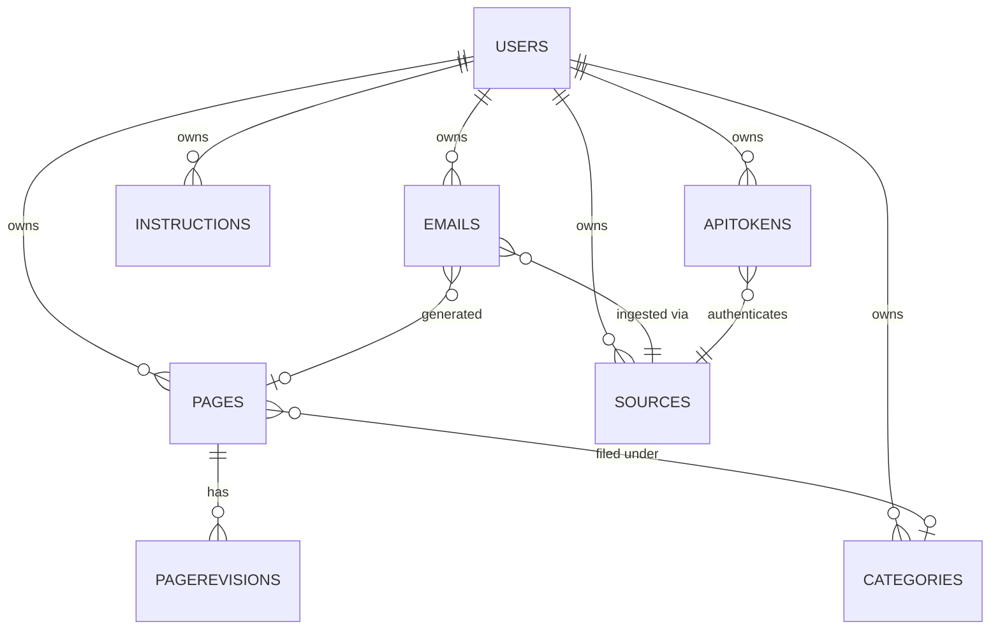

# 01 — Data Model

All collections are scoped by `userId`. Indexes are deliberately narrow; revisit when
collection cardinality grows past ~1M docs.

## Collections

### `users`
- `email` (unique), `passwordHash` (argon2id), `displayName`
- `settings.{ defaultGenerationModel, defaultEmbeddingModel, theme }`

### `emails`
- `userId`, `sourceId`, `messageId`, `threadKey`, `rawHash`
- `from`, `to[]`, `cc[]`, `subject`, `date`, `text` (cleaned), `rawText`, `html`,
  `attachments[]`
- `ingestStatus` ∈ `{pending, parsing, parsed, generated, skipped, failed}`
- `pageId` — set once generated.
- Indexes: `(userId, messageId)` unique sparse; `(userId, rawHash)` unique;
  `(userId, threadKey)`.

### `pages`
- `userId`, `slug` (unique per user), `title`, `summary`, `contentMd`, `tags[]`,
  `categoryId`, `sourceEmailIds[]`, `backlinks[]`, `version`,
  `embedding: number[]` (deselected by default), `embeddingModel`.
- Indexes: `(userId, slug)` unique, text index on `title|summary|contentMd|tags`.

### `pageRevisions`
- `pageId`, `version`, `title`, `summary`, `contentMd`, `editor: 'user' | 'llm'`.
- Index: `(pageId, version)` unique.

### `categories`
- `userId`, `name` (unique per user), `parentId`, `color`, `icon`.

### `instructions`
- `userId` (null for global system seeds), `name`, `scope`, `description`, `template`,
  `variables[]`, `isSystem`, `isDefault`.
- One default per `(userId, scope)` enforced in app code.

### `sources`
- `userId`, `type` ∈ `{upload, imap, webhook, gmail}`, `name`, `status`,
  `encryptedConfig` (AES-256-GCM, deselected), `lastSyncAt`, `lastError`.

### `apiTokens`
- `userId`, `name`, `tokenHash` (sha256), `sourceId`. Raw token shown only at creation.

## ER diagram

## Migration notes

- Mongoose `strictQuery` is on; index changes ship as `ensureIndexes()` on boot.
- Switching from in-app cosine to `$vectorSearch` requires Mongo Atlas or
  Mongo 7.0 with vector indexes; the search service interface already abstracts this.
