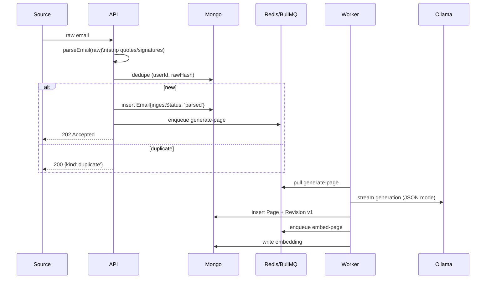

# 02 — Ingestion Pipeline

## Sources

| Source | How it arrives | Component |
| --- | --- | --- |
| Upload | `POST /api/emails/upload` (multipart) | `apps/api/src/routes/emails.ts` |
| Webhook | `POST /api/webhook/email` (raw RFC822 + Bearer token) | `apps/api/src/routes/webhook.ts` |
| IMAP | repeatable BullMQ job (per-source interval) polls via `imapflow` | `apps/worker/src/processors/imapSync.ts` |
| Gmail | repeatable BullMQ job using `googleapis` Gmail API | `apps/worker/src/processors/gmailSync.ts` |

## Flow

## Dedupe

- Primary: SHA-256 over the raw email bytes (`rawHash`). Different MUAs may rewrite
  headers, so a hash collision across MUAs is unlikely in practice.
- Secondary: `(userId, messageId)` unique-sparse. Some sources strip Message-ID, hence
  sparse.

## Retry semantics

- `generate-page` retries up to 3× with exponential backoff. JSON-parse failures count
  as a job failure so retry catches transient model output drift.
- `imap-sync` and `gmail-sync` mark the source as `error` and stash `lastError`. The UI
  surfaces this in Settings → Sources.

## Cleanup heuristics

`packages/email-parser` strips:
- Lines starting with `>`
- Everything after a `-- ` signature delimiter, em-dash separator, or `___` rule
- Reply markers like `On <date>, <name> wrote:` and Outlook header blocks
- "----- Forwarded message -----" blocks

This is heuristic, not perfect. The `parse.cleanup` instruction can re-run a pass with
the LLM if the user wants higher quality at the cost of latency/tokens.
