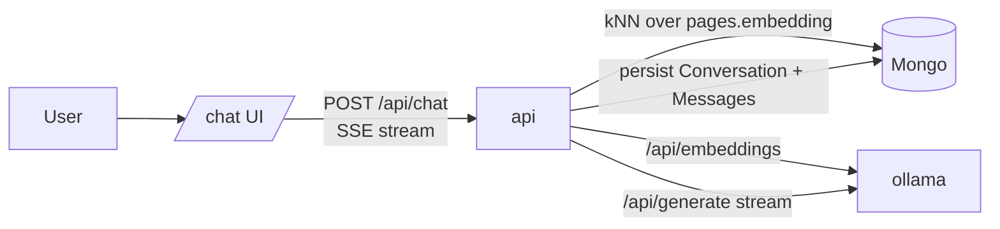

# 01 — Ask the Wiki (RAG chat)

A streaming chat surface that answers questions over the user's wiki
using retrieval-augmented generation. Citations link back to the pages
they came from. Conversations are persisted so a thread can be revisited
or continued.

## Goal

Turn the archive into a workspace. Today the wiki is a *destination* —
you go look at it. Chat makes it a *source* — you ask it.

## Topology



Retrieval and generation both happen in the API process. Generation
streams tokens out over SSE, the same channel the existing job pipeline
uses, so the UX matches.

## Data model

Two new collections, both per-user:

### `conversations`
| Field | Type | Notes |
| --- | --- | --- |
| `_id` | ObjectId | |
| `userId` | ObjectId | indexed |
| `title` | String | LLM-summarised after the first turn (≤ 60 chars) |
| `pinned` | Boolean | for sidebar pinning |
| `createdAt`, `updatedAt` | Date | |

### `messages`
| Field | Type | Notes |
| --- | --- | --- |
| `_id` | ObjectId | |
| `conversationId` | ObjectId | indexed; `{userId,conversationId}` compound |
| `userId` | ObjectId | indexed |
| `role` | enum: `user` \| `assistant` \| `system` | |
| `content` | String | markdown for assistant turns |
| `citations` | Mixed `{[label]: {pageId, slug, title, score}}` | only on assistant turns |
| `model` | String | provider:model that generated the assistant turn |
| `inputTokens`, `outputTokens` | Number | for cost surfaces later |
| `createdAt` | Date | |

### Index plan
- `messages`: `{ conversationId: 1, createdAt: 1 }`
- `conversations`: `{ userId: 1, updatedAt: -1 }`

## Retrieval

Per turn, retrieve the top-k page chunks for the question:

1. Embed the user message via the user's configured embedding provider.
2. kNN-search `pages.embedding` (cosine similarity) — top 12.
3. Re-rank with **RRF** against `$text` keyword search on the same
   query, mirroring `04-search-design.md`.
4. Slice each retrieved page's contentMd into ≤ 1.5KB windows centred
   on the highest-similarity sentence to keep the prompt budget low.
5. Pass top-6 windows to the LLM as labelled context (`[p1]…[p6]`)
   alongside the user's question and recent conversation history (last
   8 messages, capped at ~4KB).

Retrieval-only mode (no generation) is exposed at `POST /api/chat/search`
so the UI can preview "what would I see" before sending.

## Prompt

Add a new system instruction `chat.answer` (scope: new — `chat`):

```
You are answering a question over the user's personal wiki.

CONTEXT (each page is labelled `[pN]`):
{{context}}

CONVERSATION SO FAR
{{history}}

QUESTION
{{question}}

Cite every claim with `[pN]` tokens that match the labels above.
If the context doesn't contain the answer, say so plainly — never
invent facts. Reply in plain markdown; no preamble.
```

Add the scope to `Instruction.scope` enum + `InstructionScope` Zod enum.

## API surface

```
POST /api/chat                    SSE — sends back tokens, citations, then [DONE]
GET  /api/chat                    list conversations
GET  /api/chat/:id                conversation + messages
POST /api/chat/:id                continue a conversation (also SSE)
DELETE /api/chat/:id              delete
POST /api/chat/search             retrieval-only preview (top-k pages)
PATCH /api/chat/:id               rename / pin
```

`POST /api/chat` body: `{ conversationId?: string, message: string, model?: string }`.
Missing `conversationId` creates one and emits the new id as the first
SSE event.

## Worker

Title generation runs as a small background job (`rose.title-conversation`)
when the first assistant turn lands. Re-uses `provider.generate` with a
short prompt: "Summarise this exchange in ≤ 6 words."

## UI

`/chat` route, plus `c` hotkey opens a "new chat" inline drawer from
anywhere. Layout:

```
┌────────────────────────────────────────────────────┐
│ Conversations rail │ Active thread (streamed)       │
│  - Pinned          │  ┌─ user ─┐                    │
│  - Recent          │  └────────┘                    │
│                    │  ┌─ assistant ─────────────┐   │
│ + New chat         │  │ ...streamed tokens...   │   │
│                    │  │ Citations: [p1][p3]...  │   │
│                    │  └─────────────────────────┘   │
│                    │                                │
│                    │  ┌─ Compose ──────────────┐    │
│                    │  └────────────────────────┘    │
└────────────────────────────────────────────────────┘
```

- Streaming Markdown rendering for the assistant turn.
- Citation tokens render inline as superscript pills that, on hover,
  show a popover with page title + matching snippet, and on click jump
  to `/p/:slug`.
- "Show retrieved context" disclosure expands the top-k windows the LLM
  actually saw — vital for trust.
- `Edit + retry` on a previous user message replays the conversation
  from that point with the new wording.

Command palette gains a "Ask the wiki…" entry (`?` then start typing).

## Cost / performance

- Per-turn cost: 1 embedding call + 1 streaming generation. Default
  Ollama is free; Anthropic/OpenAI charged at the user's configured
  provider.
- Latency: dominated by retrieval kNN (Mongo `$vectorSearch` on Atlas;
  in-app cosine on self-host) — acceptable up to ~10k pages without
  approximation.

## Out of scope

- Real-time multi-tab sync of conversations (same user opening chat in
  two tabs). Last-write-wins is fine for v1.
- Tools / function-calling beyond retrieval. Defer until we have a
  concrete use-case.
- Voice input (covered in plan 07).
- Agentic chains. The first cut is single-shot RAG.

## Open questions

1. **History budgeting**: should we summarise older turns once a
   conversation grows past N messages, or just truncate? Truncate for
   v1, revisit if conversations get long.
2. **Sender-scoped chat**: "ask only about Stripe's emails" — would be
   great UX (filter retrieval by `senderAddresses`). Add a chip in the
   compose box that scopes to a Sender or Tag.
3. **Inline edits** to wiki pages from chat. Out of scope; the user
   navigates to the cited page to edit.

## Verification

- Cold start: empty wiki → "no context to answer that" not "I don't
  know" hallucination.
- Retrieval determinism: same question + same wiki → same top-k.
- Citation integrity: every `[pN]` token in the assistant reply maps
  to a real retrieved page; orphan citations get stripped before render.
- Cost guardrail: a malformed conversation history doesn't blow the
  context budget. Hard cap on history bytes before prompt build.
