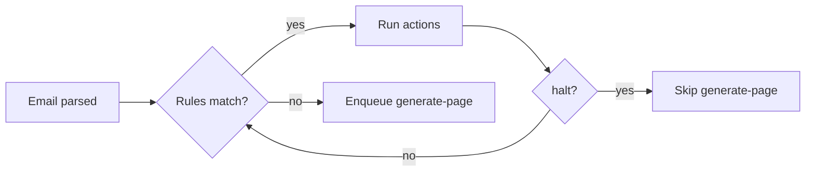

# 03 — Rules engine

User-defined automation rules. "When an email matches X, do Y." Today
every grouping, spam decision, and tag assignment is implicit. Rules
make the behaviour explicit and testable.

## Goal

Give the user durable, auditable control over how mail flows through
the wiki. Anything the heuristic does today should also be expressible
as a rule, plus actions the heuristic can't take (forward, set
priority, force-route to a topic page).

## Conceptual model

A **rule** has a `name`, an ordered list of **conditions** (ANDed), an
ordered list of **actions** (run in sequence, stops on `halt`), and a
boolean `enabled`. Rules are evaluated per ingested email *after* parse
and *before* the generate-page job is enqueued.



## Conditions

Each condition is `{ field, op, value }`. The supported pairs are:

| Field | Ops | Value |
| --- | --- | --- |
| `from.address` | `equals` `endsWith` `matches` (regex) | string |
| `from.domain` | `equals` `in` | string / list |
| `subject` | `contains` `matches` | string / regex |
| `body` | `contains` `matches` | string / regex |
| `topic` | `in` | list of tag strings |
| `header` | `present` `equals` | `{ name, value? }` |
| `spamScore` | `>=` `<` | number |
| `isPromotional` | `is` | boolean |
| `auth.spf` (etc.) | `equals` | enum value |
| `attachment.contentType` | `matches` | mime-type regex |
| `size` | `>=` `<` | bytes |

Combinator: ANDed by default. Future: explicit `any` group.

## Actions

| Action | Effect |
| --- | --- |
| `tag.add` | Append tags to the email + the page it joins |
| `tag.remove` | Inverse |
| `priority.set` | Force `high` / `normal` / `low` |
| `flag.set` | Toggle a `flags.*` value on the resulting page |
| `route.topicPage` | Force `groupingMode='topic'` + given `primaryTopic` |
| `route.threadKey` | Override the threadKey (force-merge to a page) |
| `assign.category` | Set categoryId by name (creating the category if absent) |
| `notify.push` | Fire a push notification (depends on plan 04) |
| `forward.to` | Forward the message to one or more addresses (outbound) |
| `archive` | Set `ingestStatus='skipped'`, never generate a page |
| `quarantine` | Set page-to-be `flags.autoQuarantined=true` regardless |
| `halt` | Stop subsequent rules from running |

## Data model

### `rules`
| Field | Type | Notes |
| --- | --- | --- |
| `_id` | ObjectId | |
| `userId` | ObjectId | indexed |
| `name` | String | |
| `description` | String? | |
| `enabled` | Boolean | default true |
| `priority` | Number | lower runs first; default 100 |
| `conditions` | `[{ field, op, value }]` | |
| `actions` | `[{ kind, params }]` | |
| `lastMatchedAt` | Date? | |
| `matchCount` | Number | for the rule list UI |
| `createdAt`, `updatedAt` | Date | |

### `ruleAuditLogs` (optional, capped collection)
| Field | Type | Notes |
| --- | --- | --- |
| `userId` | ObjectId | indexed |
| `ruleId` | ObjectId | |
| `emailId` | ObjectId | |
| `actions` | [{ kind, params }] | actually applied |
| `at` | Date | |

Capped at ~50k entries to keep audit cheap.

## API

```
GET    /api/rules
POST   /api/rules
GET    /api/rules/:id
PATCH  /api/rules/:id
DELETE /api/rules/:id
POST   /api/rules/:id/test     run conditions over recent emails for preview
POST   /api/rules/:id/replay   re-evaluate against existing emails (queued)
GET    /api/rules/audit?ruleId=&limit=
POST   /api/rules/reorder      bulk priority update
```

`POST /api/rules/:id/test` body: `{ limit: 100, sinceDays: 30 }`. Returns
matched email IDs + a sample so the user can see what the rule would do
before committing.

## Worker

New worker service `evaluateRules(email)`:

- Pulls all enabled rules for the user, sorted by priority asc.
- Evaluates conditions.
- Applies actions; some require persistence (tag/priority writes), some
  enqueue side effects (forward, push), some only flag the in-flight
  generate-page job (route, archive, quarantine).
- Writes one `RuleAuditLog` row per matched rule when audit is enabled.

`evaluateRules` is called from every ingest path (IMAP, Gmail, webhook,
upload, RSS) right after parse + dedupe, and before the generate-page
enqueue.

## UI

`/settings/rules` settings tab. List view shows rule cards with:

- Name, condition summary ("From medium.com → tag #medium · halt"),
  match count, last match.
- Drag-handle to reorder priority.
- Toggle for enabled.
- Test button (opens a drawer with matching emails preview).

Editor:

- Conditions block — repeating row with field/op/value.
- Actions block — repeating row, each with type-specific params.
- "Test against last 30 days" preview before save.

## Seeded rules

Ship with starter rules disabled by default the user can enable:

- `Newsletter to #newsletter` — `isPromotional=true` → `tag.add #newsletter`.
- `GitHub Actions failures` — `from.domain=github.com` AND
  `subject contains "Run failed"` → `priority.set high`.
- `Receipts` — subject regex for receipt patterns → `tag.add receipts`,
  `assign.category Receipts`.

## Out of scope

- LLM-driven rule synthesis ("write me a rule that catches X"). Defer.
- Per-action templating ("set subject = ‘[INVOICE] {{original.subject}}’").
- Time-based rules ("after 3 days, archive"). Snooze is a separate
  concept.
- Branching / nested groups beyond AND. Add `any` later if needed.

## Open questions

1. **Replay scope** — replaying a new rule against existing emails
   could change page assignments retroactively. Should it just write
   tags/priority and leave grouping alone? Default to that; offer a
   "regenerate matching pages" follow-up button.
2. **Conflict handling** — two rules tagging different categories.
   Last-write-wins, with audit log entries for the conflict.
3. **Forward-action security** — only allow forwarding to addresses on
   a user-curated allow-list to prevent compromised accounts from
   exfiltrating mail. Allow-list lives on the User.

## Verification

- Idempotent re-runs: replaying the same email twice doesn't double-tag.
- Halt semantics: `halt` action prevents subsequent rules but does not
  prevent generate-page unless paired with `archive`.
- Test endpoint never mutates state.
- Audit log writes are best-effort — a logging failure doesn't abort
  the action.
