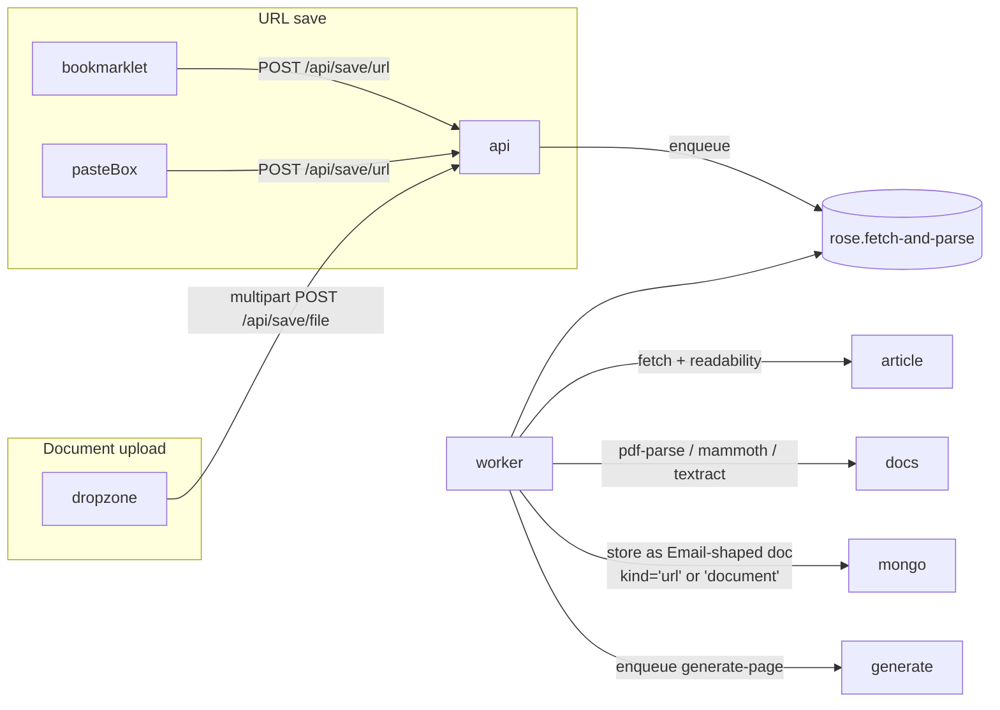

# 05 — URL + document ingestion

Save arbitrary URLs and uploaded documents (PDF, DOCX, plaintext,
Markdown) into the wiki using the same pipeline that handles emails.

## Goal

Today the wiki only knows about email + RSS. To become a real personal
knowledge base it has to ingest everything else the user wants to keep
— web articles, papers, meeting notes, screenshots of receipts.

## Topology



The worker reuses every step downstream of "Email created" — generation,
embedding, sender upsert, calendar event extraction. Nothing on the
display side knows or cares about the source kind.

## Data model

### `Email.kind` extended

Already an enum (`'email' | 'rss'`). Extend with `'url' | 'document'`.

### New stored fields (on existing `Email` schema)
| Field | Type | Notes |
| --- | --- | --- |
| `sourceUrl` | String? | original URL (for `kind='url'` and PDFs fetched from a URL) |
| `documentMeta` | Mixed? | `{filename, contentType, size, pageCount}` |
| `siteName` | String? | parsed from OG / Twitter card metadata |

### "Pseudo-sender" for URLs

To plug into the existing Sender / brand pipeline, URLs synthesise a
sender: `{ name: <site_name>, address: 'web@<domain>' }`. RSS already
does this with `feed@<domain>`; we follow the same convention so the
address book's brand-key derivation kicks in cleanly.

## API surface

```
POST  /api/save/url         { url: string, tags?: string[], note?: string }
POST  /api/save/file        multipart upload (≤ 25MB per file)
GET   /api/save/preview     ?url= … server-side preview render before save
```

Response includes the queued `jobId` so the UI can stream progress.

## Worker

New queue `rose.fetch-and-parse`. Two processor branches:

### URL branch

1. **Fetch** with a desktop user-agent, follow redirects, hard cap at
   ~5MB / 15 seconds.
2. **MIME sniff** — if HTML, run readability; if PDF, fork to the
   document branch with the bytes; otherwise reject.
3. **Readability** via `@mozilla/readability` over a `linkedom` DOM —
   produces clean HTML + title + author + siteName.
4. **HTML→Markdown** with a small Turndown configuration that keeps
   headings, lists, links, images, and code blocks; strips everything
   else.
5. **Image rehosting** — by default reference original image URLs;
   optional "snapshot images" toggle would proxy them through the
   API and store in the attachment store. Defer to a follow-up.
6. Persist as an `Email` doc with `kind='url'`, synthesised sender,
   `text`/`html` set from the readability output, `subject` from the
   article title, `date` from `published_time` meta if present.
7. Enqueue `generate-page` like normal email.

### Document branch

Multiple format handlers, each returning `{ title, text, html?, pageCount? }`:

| MIME | Library |
| --- | --- |
| `application/pdf` | `pdf-parse` (no OCR) — fast, text-only |
| `application/vnd.openxmlformats-officedocument.wordprocessingml.document` | `mammoth` — DOCX → HTML |
| `text/markdown` | passthrough |
| `text/plain` | passthrough |
| `text/html` | sanitise + readability (same as URL branch) |

Image-only PDFs return empty text. The pipeline still creates a page
with `flags.isSparse = true` so the user can decide whether to OCR
later (deferred — see open questions).

Persist as `Email` doc with `kind='document'`, synthesised sender from
the user's display name (`you@<rose-host>`), `text` filled, attachments
list including the original bytes (so the page can offer "download
original").

### Storage

Until plan 08 introduces S3/MinIO, originals are stored on disk under
`var/uploads/<userId>/<sha256>.<ext>` with a relative path tracked on
the Email's `attachments[].storageKey`. Multer is already a dependency.

## UI

### Save URL

- Address-bar bookmarklet: `javascript:fetch('https://rose/api/save/url', …)`.
- Web `+` button in Shell → "Save URL" form (paste box) and "Upload
  document" dropzone.
- Command palette: `s u <url>` to save a URL.
- Email view: any link in an email body shows a small "save to wiki"
  affordance on hover.

### Page rendering

Pages from URL/document ingestion display the source nicely:

- Eyebrow shows `WEB · siteName` or `DOCUMENT · pdf` instead of the
  email-style attribution.
- The Source section links to the original URL and / or the original
  attachment download.
- Hero image taken from `og:image` if available.

## Security

URLs are user-controlled fetch targets — classic SSRF risk. Required
mitigations:

- Resolve hostname; reject private/loopback/link-local IPs and metadata
  endpoints (169.254.169.254). Re-resolve at fetch time to defeat DNS
  rebinding.
- Reject non-https unless the user explicitly opts in per-request.
- Hard timeout, hard size cap, hard MIME allow-list.
- Server-side fetch happens in the worker (not the API) so blocking is
  isolated from user requests.

Document uploads:

- Multer config: in-memory storage off (`limits.fileSize=25MB`,
  `limits.files=1`), MIME allow-list enforced server-side (don't trust
  the client).
- PDF parsing in a child process with a 30s timeout to defend against
  pdf parser OOM bombs.

## Out of scope

- OCR for image-only PDFs / images (plan 07 covers vision).
- Bookmark folders / nested organisation. Tags + categories cover this.
- Browser extension. The bookmarklet is enough for v1.
- Snapshot-image rehosting (saving image bytes alongside the page).

## Open questions

1. **Single-page archive view** — when the original URL goes 404, the
   user wants to read what they saved. Should we keep a sanitised HTML
   snapshot? Yes, store under `attachments[]` with
   `contentType='text/html'` so the existing attachment download path
   works.
2. **Author detection** — Readability's `byline` is unreliable. Fall
   through to OpenGraph `article:author`, then leave blank. Don't
   guess.
3. **Per-source poll for changing URLs** — RSS handles "watch this
   feed". For URLs that update (e.g. wiki pages), should we poll? No
   for v1; the user can re-save.

## Verification

- SSRF: `http://169.254.169.254/` → 400 with a clear error; never
  reaches the actual fetcher.
- Readability quality: spot-check ~10 representative pages (NYT,
  GitHub README, an academic paper, a Substack post) — title, body,
  hero image extracted correctly.
- PDF: a 200-page paper extracts text in <10 seconds, doesn't OOM the
  worker. Fall back gracefully on malformed PDFs.
- Idempotency: saving the same URL twice deduplicates by `sourceUrl`,
  doesn't create two pages.
