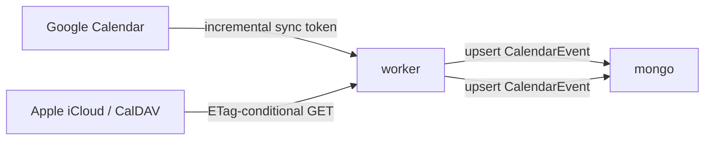

# 06 — External sources

Beyond email + RSS + URL, ingest from chat platforms (Slack, Discord)
and unify two-way calendar sync (Google / Apple / iCal).

## Goal

The wiki should reflect everything you read or attend, not just your
inbox. A daily Slack digest of channels you watch should land as a
wiki page. Calendar events should flow both ways so meetings created
in Google Calendar show up here, and events extracted from email show
up in Google Calendar.

## Components

This plan ships three independent integrations:

1. [Slack ingestion](#slack-ingestion)
2. [Discord ingestion](#discord-ingestion)
3. [Two-way calendar sync](#two-way-calendar-sync)

---

## Slack ingestion

Daily / weekly summary pages of channels the user watches. Optionally,
saved-message ingestion (one-off bookmark of an interesting thread).

### Connection

Slack integration uses a workspace-scoped OAuth token with the
following scopes:

- `channels:history`, `groups:history`, `im:history`, `mpim:history`
  (read messages in user-permitted channels)
- `users:read` (resolve user IDs to names)
- `bookmarks:read` (saved-for-later items)

We do *not* request write scopes — Rose is read-only on Slack.

### Data model

`Source.type` extended with `'slack'`. `encryptedConfig`:
```ts
{
  workspaceId: string,
  accessToken: string,        // encrypted
  watchedChannels: string[],  // channel IDs
  cadence: 'daily' | 'weekly',
  cursor: string | null       // last seen timestamp
}
```

### Worker

New processor `slackSync.ts`:

1. For each watched channel, fetch messages newer than `cursor`.
2. Filter (skip joins/leaves, bot threads).
3. Group by thread; resolve user IDs to display names.
4. Concatenate into a single body text. Pseudo-sender is
   `slack@<workspace>.<workspaceId>`.
5. Persist as `Email` doc with `kind='slack'` + `subject` =
   "Slack — #channel — YYYY-MM-DD" (or week range for weekly).
6. Enqueue generate-page; the LLM produces a wiki page that
   summarises the channel's activity.
7. Update `cursor`.

### Display

Channel pages get an eyebrow `SLACK · #channel` and link back to the
original message in Slack via `slack://` deep links.

---

## Discord ingestion

Similar shape to Slack, with a Discord bot token approach instead of
user OAuth. The user invites the Rose bot to selected channels; the
bot reads message history.

### Differences from Slack

- Bot rather than user-token; less scope to manage but the user has
  to install the bot in their server.
- Discord's API doesn't paginate as cleanly; use snowflake IDs and
  `before=`/`after=` cursors.
- Pseudo-sender: `discord@<guildId>`.

Otherwise the pipeline is identical.

---

## Two-way calendar sync

Google Calendar (and Apple Calendar via CalDAV) are pulled and pushed.

### Pull



`Source.type` extended with `'gcal'` and `'caldav'`. `encryptedConfig`
holds the OAuth refresh token (for Google) or CalDAV credentials.

The pull worker:

1. Calls `events.list` with `syncToken` for incremental semantics.
2. Maps each Google event into our `CalendarEvent` shape, preserving
   `source: 'gcal'` and the upstream event id for round-trip.
3. Drops events the user already extracted from email (dedup by
   `start + title` exact match within a 5-minute window).

### Push

When the email-extraction pipeline produces a new `CalendarEvent`,
optionally push it to the user's primary external calendar:

- Push toggle per Source; default OFF (privacy-preserving).
- On push, set the upstream event id back on the local event so we
  don't re-import on the next pull.

### Conflict policy

Last-write-wins, keyed on a per-event `etag`. When the upstream event
is edited between push and our next sync, we keep the upstream edit
and surface a "diverged" badge in the calendar view.

### CalDAV specifics

- Apple iCloud requires app-specific passwords (similar to Gmail).
- iCloud's CalDAV root is `https://caldav.icloud.com/` with a
  user-specific principal URL discovered via PROPFIND.

We use `tsdav` (or roll a thin client over `node-fetch` + XML).

---

## API surface (across all three)

These integrations slot into the existing `/api/sources` CRUD with new
discriminated-union variants in `SourceCreateRequest`. No new routes.

For calendar push, add an event-level POST:

```
POST /api/events/:id/push?source=gcal      push to a configured external calendar
DELETE /api/events/:id/push?source=gcal    remove from external calendar
```

## Out of scope

- Microsoft Teams / Outlook calendar (different OAuth dance, not yet
  worth the surface area).
- Slack DM ingestion. Worth doing later but raises trickier privacy
  questions; channels first.
- Two-way sync that reconciles attendee lists or RSVPs. Pull/push of
  the event itself is the v1 scope.

## Open questions

1. **Slack bot vs user token**: a bot would let multiple Rose users in
   a workspace share an install, but a user token is simpler for solo
   installs. Default to user token; revisit if multi-user lands.
2. **Calendar de-dup boundary** — 5 minute window for matching events
   may be too tight for all-day events. Special-case those to match on
   `date + title`.
3. **Rate limits** — Slack and Discord both rate-limit aggressively.
   Use a token bucket per integration; abort and reschedule when
   throttled.

## Verification

- Slack: a freshly-watched channel produces today's first digest and
  thereafter advances `cursor` monotonically — no duplicate ingestion.
- Calendar pull: deleting an event upstream removes it locally on the
  next sync.
- Calendar push round-trip: pushing an extracted event then editing it
  in Google Calendar shows the new title in Rose on next pull, without
  duplicating.
